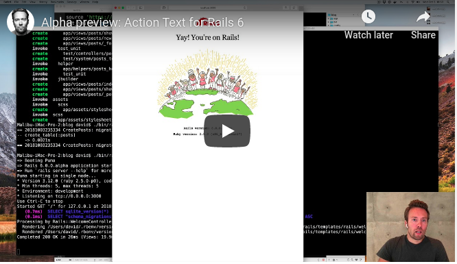

couple hours before DHH announcing that the Rails team is working towards bringing Trix, the rich text editor from Basecamp into Rails applications by default as Action Text. I was googling a simple way to use the editor in my blog and I found this video that he showed quickly how to get started with Action Text by building a blog with a rich text area. This shows off some other things coming to Rails 6, as the default use of web-packer. Action Text hooks closely into Active Storage which was only new in Rails 5.2.

## Take a look at the video and see what you think

Rails 6 is shaping up to be a major release.
Besides Action Text, Basecamp has been cooking several other new frameworks in Basecamp 3 that we hope to extract.
On top of all the wonderful work coming from others in the community,
like the multi-DB and parallel testing extractions that the team at GitHub are responsible for.
This is a great time to be in Rails!
Have you needed rich text and struggled to use something
that works well? Will this get you to install the edge version of Rails to try it out?

## References
- [actiontext](https://github.com/rails/actiontext)

- [introducing-action-text-for-rails-6](https://weblog.rubyonrails.org/2018/10/3/introducing-action-text-for-rails-6/)
