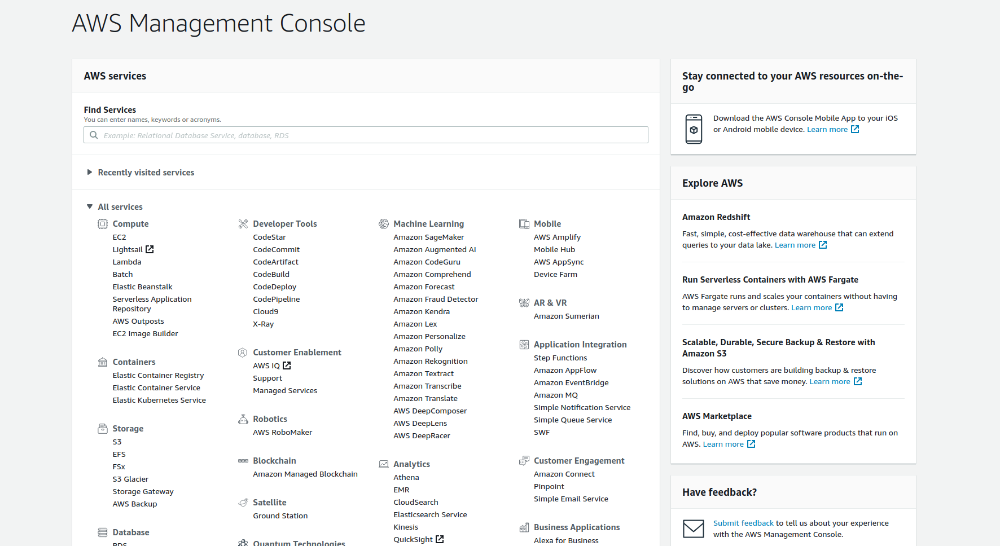
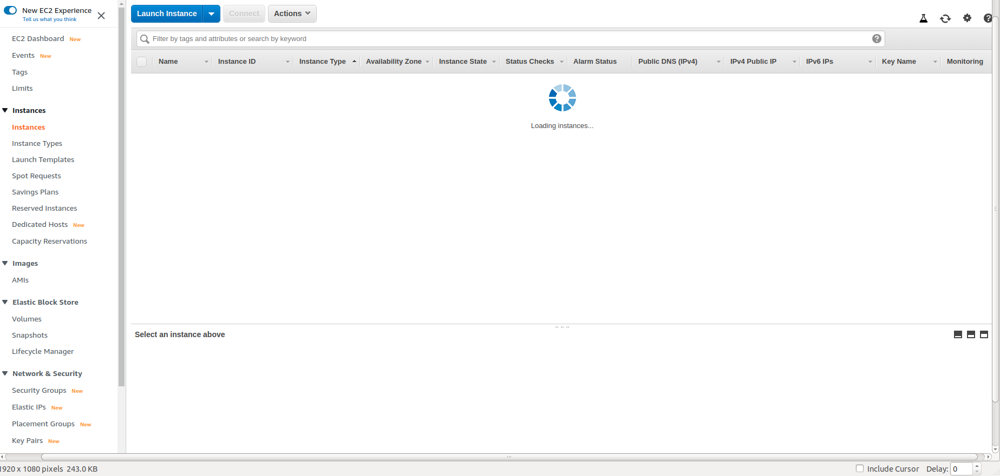
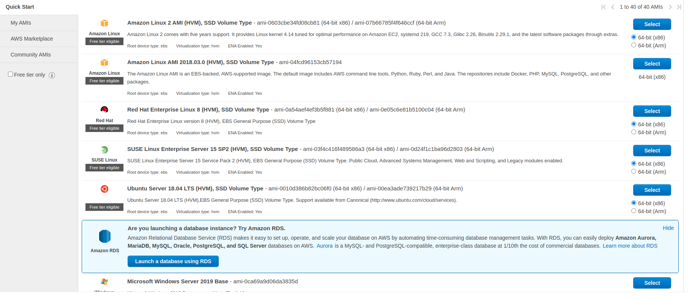

 


<span style="color: #89270a; letter-spacing: 0.09em; font-size: 30px; font-weight: 600;"> Deplyment </span> is moving your code from local machine to the server to make your application accessible by end-users. in this article we will go through all the process from setting the instance, dependencies, to deploying the code using the Capistrano tool

- <span style="color: #89270a; letter-spacing: 0.03em; font-size: 25px; font-weight: 300;"> Set up EC2 Ubuntu </span>

`Note: if you already configured the instance, please jump to the next step`

First of all, we will need a valid AWS account to setup the instance. if you already have an account, please [Sign in](https://signin.aws.amazon.com/signin?redirect_uri=https%3A%2F%2Fconsole.aws.amazon.com%2Fconsole%2Fhome%3Fstate%3DhashArgs%2523%26isauthcode%3Dtrue&client_id=arn%3Aaws%3Aiam%3A%3A015428540659%3Auser%2Fhomepage&forceMobileApp=0&code_challenge=MD3yXqK8aNOciUyEyk4HgGKVt2IxqIoyUV4kG98YHnU&code_challenge_method=SHA-256) otherwise, create a new one [Create an AWS account](https://portal.aws.amazon.com/billing/signup#/start)

Assuming you have created an AWS account let's login to our console and set up the instance
- Step 1: Select the first one `EC2`



- Step 2: go to instances and select launch instance


- Step 3: Choose an Amazon Machine Image (AMI) in our case we will choose `Ubuntu Server 18.04 LTS (HVM), SSD Volume Type` and complete the rest of the steps and coonect to the server via ssh `ssh -p 22 -i ~/.ssh/[YOUR_KEY] ubuntu@[YOUR_IP_ADDRESS]
`.



- <span style="color: #89270a; letter-spacing: 0.03em; font-size: 25px; font-weight: 300;"> installing dependencies </span>

Having a vanilla server like having a new PC with OS which will need from you to install the dependencies of your stack. If your Ruby on rails developer you will need to install RVM, Ruby, pg, MySQL, etc or if your front end developer you will need to install front end dependencies like node, npm, yarn, and etc.
In our case, we will need to install Nginx, PG` (If your using MySQL install the MySql engine)`, RVM, Redi`(If your planning to use Background jobs)`

#### 1) ngix + required packages

```powershell
sudo apt-get update
sudo apt-get upgrade -y
sudo apt-get install curl git-core nginx build-essential tcl8.5 -y
```

#### 2) DB engine
install your DB engine `pg` or `Mysql`
- PostgresQL -
  `sudo apt-get install libpq-dev postgresql postgresql-contrib`
- MySql -
  `sudo apt-get install libmysqlclient-dev mysql-server`

#### 2) Redis
`Note: if you're not using any Back-ground jobs in your application like Resque or sidekiq pls skip this step`

[Redis](https://redis.io/) is an open source (BSD licensed), in-memory data structure store, used as a database, cache and message broker. It supports data structures such as strings, hashes, lists, sets, sorted sets with range queries, bitmaps, hyperloglogs, geospatial indexes with radius queries and streams. Redis has built-in replication, Lua scripting, LRU eviction, transactions and different levels of on-disk persistence, and provides high availability via Redis Sentinel and automatic partitioning with Redis Cluster

```PowerShell
cd ~
wget http://download.redis.io/releases/redis-stable.tar.gz
tar xzf redis-stable.tar.gz
cd redis-stable
make
make test
sudo make install
cd utils
sudo ./install_server.sh
```

#### 3) RVM
[RVM](https://rvm.io/) is a command-line tool which allows you to easily install, manage, and work with multiple ruby environments from interpreters to sets of gems.

- Install GPG keys:
```powershell
gpg2 --recv-keys 409B6B1796C275462A1703113804BB82D39DC0E3 7D2BAF1CF37B13E2069D6956105BD0E739499BDB
```
- Install RVM and Ruby
```powershell
curl -sSL https://get.rvm.io | bash -s stable
source ~/.rvm/scripts/rvm
rvm requirements
rvm install 2.7.1
rvm use 2.7.1 --default
```
- Auto update rvm

```powershell
echo rvm_autoupdate_flag=2 >> ~/.rvmrc
```

- install `rails`, `bundler`, (`mysql2`or `pg`) gems
```powershell
gem install rails -V --no-ri --no-rdoc
gem install bundler -V --no-ri --no-rdoc
gem install mysql2 -v '0.4.3'
gem install pg -v '1.0.0'
```

#### 4) Generate ssh key
*Ssh-keygen* is a tool for creating new authentication key pairs for SSH. Such key pairs are used for automating logins, single sign-on, and for authenticating hosts.

- Generate new one `ssh-keygen -t rsa`
- Print generated key `cat ~/.ssh/id_rsa.pub`

Before we go to the next step please check if everything is installed perfectly in the previous steps, if it's not please re-check and install again
```powershell
~$ nginx -v
# nginx version: nginx/1.14.0 (Ubuntu)
~$ rails -v
# Rails 5.2.2
~$ bundler -v
# Bundler version 2.0.1
~$ mysqld --version
# mysqld  Ver 5.7.31-0ubuntu0.18.04.1 for Linux on x86_64 ((Ubuntu))
~$ psql --version
# psql (PostgreSQL) 12.3 (Ubuntu 12.3-1.pgdg18.04+1)
~$ redis-server --version
# Redis server v=4.0.9 sha=00000000:0 malloc=jemalloc-3.6.0 bits=64 build=9435c3c2879311f3
```
- <span style="color: #89270a; letter-spacing: 0.03em; font-size: 25px; font-weight: 300;"> Configuring rails with Capistrano </span>

[Capistrano](https://github.com/capistrano/capistrano) is a deployment automation tool built on Ruby, Rake, and SSH. Although Capistrano itself is written in Ruby, it can easily be used to deploy projects of any language or framework, be it Rails, Java, React, or PHP

#### 1) Install the Capistrano gems
```ruby
group :development do
  gem 'capistrano', '~> 3.9'
  gem 'capistrano-db-tasks', require: false
  gem 'capistrano-rails', '~> 1.2'
  gem 'capistrano-rvm'
  gem 'capistrano3-puma'
end
```
NOTE: if you're using Resque you will need to add `capistrano-resque` as well
```ruby
gem 'capistrano-resque', '~> 0.2.3', require: false
```
Run `bundle` than `bundle exec cap install`

This creates all the necessary configuration files and directory structure for a Capistrano-enabled project with two stages, staging and production

```pwoershell
├── Capfile
├── config
│   ├── deploy
│   │   ├── production.rb
│   │   └── staging.rb
│   └── deploy.rb
└── lib
    └── capistrano
            └── tasks

```

Please compare your `Capfile` with following and add required gems here as well
```ruby
# frozen_string_literal: true

# Load DSL and set up stages
require 'capistrano/setup'

# Include default deployment tasks
require 'capistrano/deploy'

require 'capistrano/scm/git'
install_plugin Capistrano::SCM::Git

# Include tasks from other gems included in your Gemfile
require 'capistrano/rvm'
require 'capistrano/bundler'
require 'capistrano/rails/migrations'
require 'capistrano/puma'
require 'capistrano-resque'
require 'capistrano-db-tasks'

install_plugin Capistrano::Puma
install_plugin Capistrano::Puma::Nginx

# Load custom tasks from `lib/capistrano/tasks` if you have any defined
Dir.glob('lib/capistrano/tasks/*.rake').each { |r| import r }

```
#### 2) SetUp deploy.rb
Replace the values in `deploy.rb` with correct values
```ruby
# config valid for current version and patch releases of Capistrano
lock '~> 3.11.0'

set :application, 'application_name'
set :repo_url, 'git@example.com:me/my_repo.git'
set :rails_env, fetch(:stage)
append :rvm_map_bins, 'rails'

set :deploy_to, "/var/www/html/#{fetch(:application)}"

set :format_options, command_output: true, log_file: 'log/capistrano.log', color: :auto, truncate: :false

set :rvm_type, :user
set :rvm_ruby_version, '2.5.0@gemset'

append :linked_files, 'config/database.yml', 'config/master.key'

append :linked_dirs, 'log', 'tmp/pids', 'tmp/cache', 'tmp/sockets', 'public/system', 'storage'

set :keep_releases, 5
```
Once you updated `deploy.rb` file create `database.yml` and `master.key` in the deployment path and run `cap production deploy:check` to check if there are any other configuration missing, if everything is worked fine run `cap production deploy`, Here we go.
Our app should be deployed to production now!
#### 3) SetUp deployment environments and nginx configuration
Rails have multiple environments that mean we can deploy our code in multiple servers with multiple domain, `test`, `staging`, and `production` are most environment used in the rails community.

Let's update our `config/deploy/production.rb` with the correct data and upload Nginx config to the server

```ruby
# frozen_string_literal: true

set :branch, 'master'
set :resque_rails_env, 'production'
role :resque_worker, 'ip.000.00.ip'
role :resque_scheduler, 'ip.000.00.ip'

set :workers, '*' => 1
set :nginx_server_name, "your-domain.com #{fetch(:application)}.local"

server 'ip.000.00.ip',
        user:  'ubuntu',
        roles: %w[web app db]
```

Run, `cap production puma:nginx_config` to setup nginx configuration and restart the nginx services in the server
`sudo service nginx restart`

Open the browser and specify the application address. `www.your-domain.com`