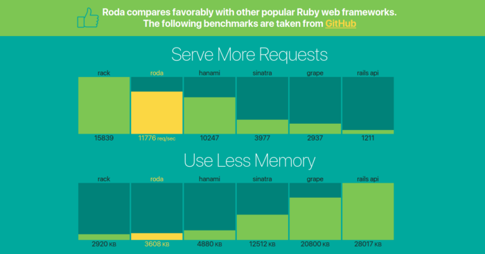
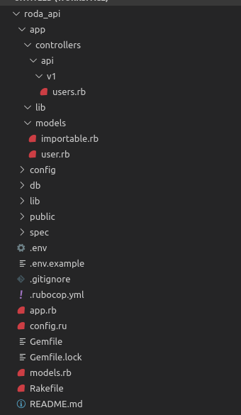
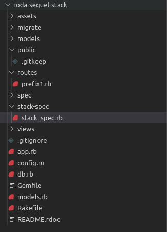
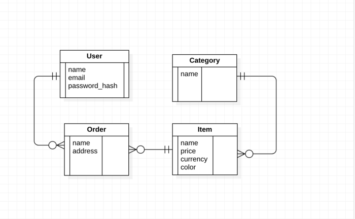

<span style="color: #9b111e; letter-spacing: 0.09em; font-size: 30px; font-weight: 600;">Roda</span>is a lightweight and productive framework for building web applications using <span style="color: #9b111e; letter-spacing: 0.09em; font-size: 15px; font-weight: 600;"> Ruby</span>. as mentioned in Roda’s [Website](https://roda.jeremyevans.net/), Roda is designed to be simple, both internally and externally, reducing cognitive overhead. Roda uses a routing tree which means At any point during routing, it allows you to operate on the current request.



Let’s stop praising Roda and start building some useful things.

Before you go through this article you need to have some basic knowledge about<span style="color: #9b111e; letter-spacing: 0.09em; font-size: 15px; font-weight: 600;"> Ruby</span>  -> [Get started with ruby](https://www.ruby-lang.org/en/)

# Getting started

Installing Roda

```powershell
$ gem install bundler
$ gem install roda
```

Unfortunately there are currently no site generators in Roda like there is in Ruby on Rails (rails new myapp). which means we have to generate our application directories and files manually or we can use the roda’s creator’s stack [roda-sequel-stack.](https://github.com/jeremyevans/roda-sequel-stack)

Also there is no ActiveRecord as database ORM in [Roda](https://roda.jeremyevans.net/), roda uses [Sequal](https://github.com/jeremyevans/sequel). It’s better to take a glance at [Sequel](https://github.com/jeremyevans/sequel).

Options to structure the project files

- Using my repo, i tried to keep the structure as we used to in Rails


```powershell
git clone https://github.com/MajedBojan/roda_api/tree/setup_project_structure
cd roda_api
rm -rf .git
bundle install
# follow the developer guide over there to setup the database
```


- Or you can use Jeremy Evans’s [repo](https://github.com/jeremyevans/roda-sequel-stack)



```powershel
$ git clone https://github.com/jeremyevans/roda-sequel-stack
$ mv roda-sequel-stack my_app
$ cd my_app
$ rake setup[MyApp]
```

The main file in the app is `app.rb` and this file has been loaded via `config.ru` to serve the application with `rackup` command

```ruby
# frozen_string_literal: true
require './config/application.rb'
Config::DB.connect
class App < Roda
  plugin :hash_routes
  Sequel::Model.plugin :validation_helpers
  Sequel::Model.plugin :timestamps, update_on_create: true # To populate timestamps on record creation
  # use Rack::Session::Cookie, secret: 'some_nice_long_random_string_DSKJH4378EYR7EGKUFH', key: '_roda_app_session'
  # use Rack::Protection
  # plugin :csrf
  plugin :head
  plugin :json, classes: [Array, Hash, Sequel::Model], content_type: 'application/json'
  plugin :json_parser
  plugin :all_verbs
  plugin :halt
  require './app/models/user.rb'
  require './app/models/category.rb'
  require './app/models/item.rb'
  require './app/models/order.rb'
  Unreloader.require('app/controllers/api/v1') {}
  route do |r|
    r.root do
      { success: true, message: 'Application server is up', env: ENV['RACK_ENV'] }
    end
    r.hash_routes
  end
end
```


Run `rackup` now, make GET request to our app’s root / URL, and you should see server status response.


```ruby
{
    "success": true,
    "message": "Application server is up",
    "env": "development"
}
```

let’s start build our app it’s simple app to show you how easy we can create an application in roda framework.
we are going to build simple app which is displaying items and user can purchase these items.
Our schema should look like this


if you cloned my repo you don’t need to do step 0
Step 0

```powershell
  touch app/models/user.rb db/migrate/001_create_users.rb
```

```ruby
# db/migrate/001_create_users.rb
Sequel.migration do
  change do
    create_table(:users) do
      primary_key :id, unique: true
      String :name, null: false
      String :email, unique: true, null: false
      String :password_hash, null: false
    end
  end
end
```


```ruby
# app/controllers/api/v1/users.rb
# frozen_string_literal: true
class App
  hash_branch('users') do |r|
    r.get do
      page = r.params[:page] || 1
      { message: 'Data found', data: { users: User.paginate(page, 10).map(&:to_json) } }
    end
    r.post do
      @user = User.create(user_params(r))
      { message: 'User Created successfully', data: { user: @user } }
    end
    r.is 'user', Integer do |user_id|
      # user/:id used to match get, put and delete request, to provide
      # getting user by id, updating and deleting user
      @user = User[user_id]
      # use halt to return 404 without evaluating rest of the block
      r.halt(404) unless @user
      r.get do
        { user: @user.to_json }
        { message: 'Data found', data: { user: @user } }
      end
      r.put do
        @user.update(user_params(r))
        { message: 'User Updated successfully', data: { user: @user } }
        { user: @user }
      end
      r.delete do
        @user.destroy
        response.status = 204
        { message: 'User Deleted successfully', data: { user_id: user_id } }
      end
    end
  end
  private
    def user_params(r)
      { name: r.params['name'], email: r.params['email'], password_hash: r.params['password'] }
    end
end

```

### Step 1

Create the models files for `category, item, and order`

```powershell
  touch app/models/category.rb app/models/item.rb app/models/order.rb
```


let’s create migration files for those models as well `category, item, and order`


```powershell
  touch db/migrate/002_create_categories.rb db/migrate/003_create_items.rb db/migrate/004_create_orders.rb
```
Copy the next lines to the models to define the relationship between them.

```ruby
# app/models/category.rb
# frozen_string_literal: true

class Item < Sequel::Model
  plugin :json_serializer
  one_to_many :orders
  many_to_one :category
end
```

```ruby
# app/models/item.rb
# frozen_string_literal: true
class Item < Sequel::Model
  plugin :json_serializer
  one_to_many :orders
  many_to_one :category
end
```

```ruby
# app/models/order.rb
# frozen_string_literal: true
class Order < Sequel::Model
  plugin :json_serializer
  many_to_one :item
  many_to_one :user
end
```

Add migration to predefined migration files
```ruby
# db/migrate/002_create_categories.rb

Sequel.migration do
  change do
    create_table(:categories) do
      primary_key :id, unique: true
      String :name, null: false
    end
  end
end
```

```ruby
# db/migrate/002_create_orders.rb

Sequel.migration do
  change do
    create_table(:orders) do
      primary_key :id, unique: true
      foreign_key :user_id, :users, null: false
      foreign_key :item_id, :items, null: false
      String :name, null: false
      String :address, null: false
    end
  end
end
```


```ruby
# db/migrate/003_create_items.rb
Sequel.migration do
  change do
    create_table(:items) do
      primary_key :id, unique: true
      foreign_key :category_id, :categories, null: false
      String :name, null: false
      String :price, null: false
      String :currency, null: false
      String :color, null: false
    end
  end
end
```

Here we go!!!! run `rake db:migrate`

The next step is to create CRUD operations for our classes, RODA provides a plugin that helps to split out the controllers which is plugin :hash_routes

let’s create the controller’s files for `categories, items, and orders`

```powershell
  touch app/controllers/api/v1/categories.rb app/controllers/api/v1/items.rb app/controllers/api/v1/orders.rb
```

let’s start with categories and create the CRUD operations app/controllers/api/v1/categories.rb

```ruby
# frozen_string_literal: true
class App
  hash_branch('categories') do |r|
    r.get do
      { message: 'Data found', data: { categories: Category.all } }
    end
    r.post do
      @category = Category.create(category_params(r))
      { message: 'Category Created successfully', data: { category: @category } }
    end
      r.is 'category', Integer do |user_id|
        # category/:id used to match get, put and delete request, to provide
        # getting category by id, updating and deleting category
        @category = Category[user_id]
        # use halt to return 404 without evaluating rest of the block
        r.halt(404) unless @category
        r.get do
        { message: 'Data found', data: { category: @category } }
      end
      r.put do
        @category.update(category_params(r))
        { message: 'Category Updated successfully', data: { category: @category } }
      end
      r.delete do
        @category.destroy
        response.status = 204
        { message: 'Category Deleted successfully', data: { user_id: user_id } }
      end
    end
  end
  private
  def category_params(r)
  { name: r.params['name'] }
  end
end

```

```ruby
# app/controllers/api/v1/items.rb

# frozen_string_literal: true
class App
  hash_branch('items') do |r|
    r.get do
      { message: 'Data found', data: { items: Item.all } }
    end
    r.post do
      @item = Item.create(item_params(r))
      { message: 'Item Created successfully', data: { item: @item } }
    end
    r.is 'item', Integer do |user_id|
      # item/:id used to match get, put and delete request, to provide
      # getting item by id, updating and deleting item
      @item = Item[user_id]
      # use halt to return 404 without evaluating rest of the block
      r.halt(404) unless @item
      r.get do
      { message: 'Data found', data: { item: @item } }
      end
      r.put do
        @item.update(item_params(r))
        { message: 'Item Updated successfully', data: { item: @item } }
      end
      r.delete do
        @item.destroy
        response.status = 204
        { message: 'Item Deleted successfully', data: { user_id: user_id } }
      end
      end
    end
    private
      def item_params(r)
        prms = r.params
        {
        name:        prms['name'],
        category_id: prms['category_id'],
        price:       prms['price'],
        currency:    prms['currency'],
        color:       prms['color']
        }
      end
end

```

```ruby
# app/controllers/api/v1/orders.rb

# frozen_string_literal: true
class App
  hash_branch('orders') do |r|
    r.get do
      { message: 'Data found', data: { orders: Order.all } }
    end
    r.post do
      @order = Order.create(order_params(r))
      { message: 'Order Created successfully', data: { order: @order } }
    end
    r.is 'order', Integer do |user_id|
      # order/:id used to match get, put and delete request, to provide
      # getting order by id, updating and deleting order
      @order = Order[user_id]
      # use halt to return 404 without evaluating rest of the block
      r.halt(404) unless @order
      r.get do
        { message: 'Data found', data: { order: @order } }
      end
      r.put do
        @order.update(order_params(r))
        { message: 'Order Updated successfully', data: { order: @order } }
      end
      r.delete do
        @order.destroy
        response.status = 204
        { message: 'Order Deleted successfully', data: { user_id: user_id } }
      end
    end
  end
  private
    def order_params(r)
      prms = r.params
      {
      name:    prms['name'],
      user_id: prms['user_id'],
      item_id: prms['item_id'],
      address: prms['address']
      }
    end
end
```

Now you can create some record using POSTMAN or Curl

```powershell
curl -X GET \
  http://localhost:9292/items \
  -H 'Accept: */*' \
  -H 'Cache-Control: no-cache' \
  -H 'Connection: keep-alive' \
  -H 'Host: localhost:9292' \
  -H 'Postman-Token: cf32b100-1768-4e6a-a9f6-250f82c7818f,d2dbafc1-2abb-45a1-b6e8-9605ac964563' \
  -H 'User-Agent: PostmanRuntime/7.11.0' \
  -H 'accept-encoding: gzip, deflate' \
  -H 'cache-control: no-cache' \
  -H 'cookie: _roda_app_session=BAh7CUkiD3Nlc3Npb25faWQGOgZFVEkiRWVhYTJlNTkyMTVjNzI5NjBiYmE3%0AMjg5NmE5MjY4ZTgyM2ZkZTc1MDIxOWQxZTBiMDVjOTMyMTU0NmIwYTYzZGUG%0AOwBGSSIJY3NyZgY7AEZJIiU3ZWM0MTUzOTc1MjMyODJlMjI5ZmZiYTY4M2Vk%0AZGY2NgY7AEZJIg10cmFja2luZwY7AEZ7B0kiFEhUVFBfVVNFUl9BR0VOVAY7%0AAFRJIi0zZWFlODY4NjcwNGU3ODYzZTY0ZGE0Y2FmN2E1MzBjN2U4NTBkZWUx%0ABjsARkkiGUhUVFBfQUNDRVBUX0xBTkdVQUdFBjsAVEkiLWRhMzlhM2VlNWU2%0AYjRiMGQzMjU1YmZlZjk1NjAxODkwYWZkODA3MDkGOwBGSSIPY3NyZi50b2tl%0AbgY7AFRJIjF5NWt2L3Z2b2tOeEJUdWx2cXUwMEJXd1h5eUd2RTZkMUU4V0Fw%0ASE1aNXgwPQY7AEY%3D%0A--d7d71f817fed2b00103c5adc63370f29bf210b32' \
  -b _roda_app_session=BAh7CUkiD3Nlc3Npb25faWQGOgZFVEkiRWVhYTJlNTkyMTVjNzI5NjBiYmE3%0AMjg5NmE5MjY4ZTgyM2ZkZTc1MDIxOWQxZTBiMDVjOTMyMTU0NmIwYTYzZGUG%0AOwBGSSIJY3NyZgY7AEZJIiU3ZWM0MTUzOTc1MjMyODJlMjI5ZmZiYTY4M2Vk%0AZGY2NgY7AEZJIg10cmFja2luZwY7AEZ7B0kiFEhUVFBfVVNFUl9BR0VOVAY7%0AAFRJIi0zZWFlODY4NjcwNGU3ODYzZTY0ZGE0Y2FmN2E1MzBjN2U4NTBkZWUx%0ABjsARkkiGUhUVFBfQUNDRVBUX0xBTkdVQUdFBjsAVEkiLWRhMzlhM2VlNWU2%0AYjRiMGQzMjU1YmZlZjk1NjAxODkwYWZkODA3MDkGOwBGSSIPY3NyZi50b2tl%0AbgY7AFRJIjF5NWt2L3Z2b2tOeEJUdWx2cXUwMEJXd1h5eUd2RTZkMUU4V0Fw%0ASE1aNXgwPQY7AEY%3D%0A--d7d71f817fed2b00103c5adc63370f29bf210b32

```

Here is the [Complete Code](https://github.com/MajedBojan/roda_api.git)

## References
[jeremyevans's sequel](https://github.com/jeremyevans/sequel)
[jeremyevans's roda]()
[HashRoutes](https://roda.jeremyevans.net/rdoc/classes/Roda/RodaPlugins/HashRoutes.html)
[mastering-roda](https://fiachetti.gitlab.io/mastering-roda/#get-and-post)
[simple-roda-blog-tutorial](https://mrcook.uk/simple-roda-blog-tutorial)